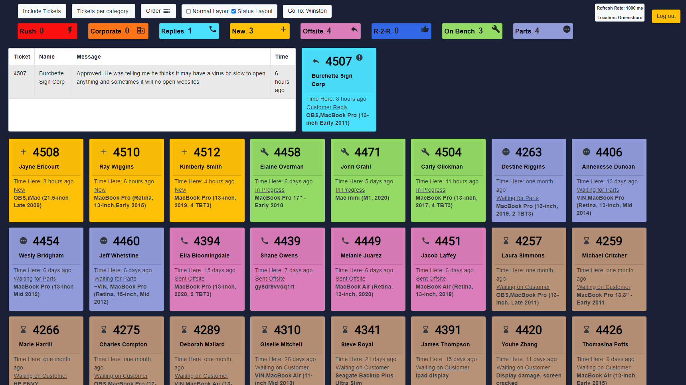
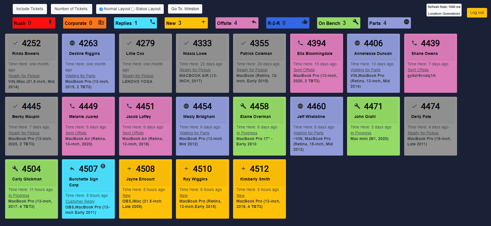
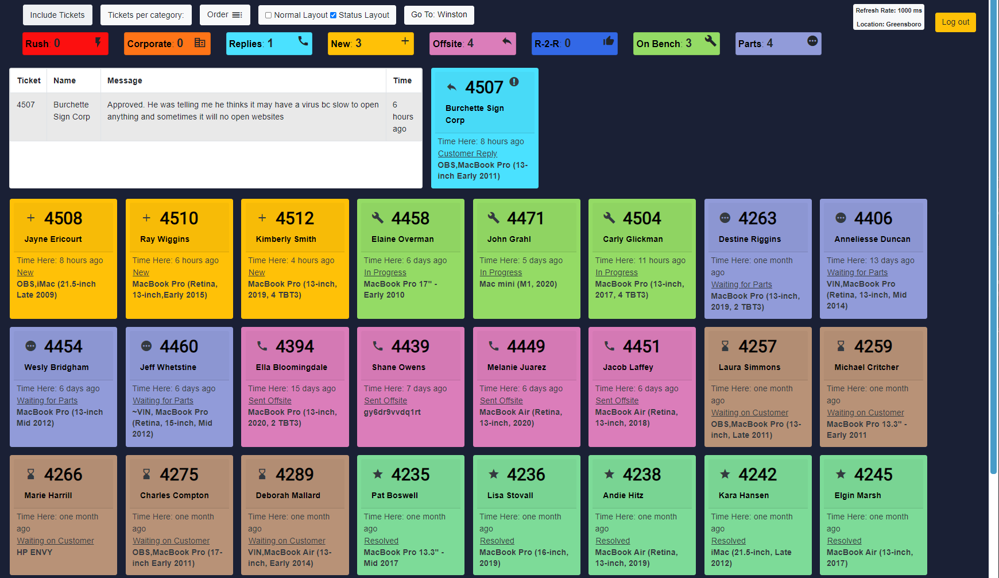

# Ticket-Dashboard

This is a personal project I created to help improve the workflow in the repair cernter I work at. We do Mac and PC repairs and have devices checked in using a ticket system. This display is shown on a large TV in the service room. It shows the technicians what repairs are coming up next, when we get contacted by a customer, and when a ticket has been sitting for too long. Since implementing this we've seen an increase in repair processing time. The site requires authorization to use but these are a few images of it.

